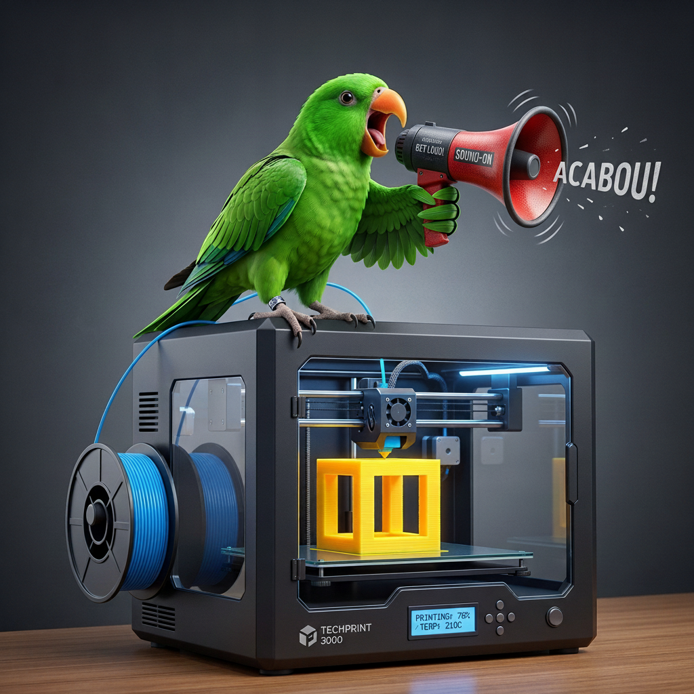

# 🦜 ParrotPrinter

<p align="center">
  
</p>

**Monitoramento por Voz e Alarmes de Áudio para Impressoras 3D (Klipper / Moonraker)**

ParrotPrinter é um assistente de voz e central de alarmes de áudio em tempo real para as suas impressoras 3D equipadas com Klipper/Moonraker. Ele detecta os códigos impressos ou mensagens de erro no console G-code e pronuncia de forma falada o nome da impressora correspondente e o evento atual ou dispara alarmes sonoros personalizados.

---

## 🛠️ Prerrequisitos do Sistema (Computador Local)

Para executar o ParrotPrinter no seu computador local, você precisa ter instalados:
1. **Node.JS (Versão 18 ou superior)**: O motor de execução JavaScript e TypeScript que roda o painel local e coleta as websockets das impressoras.
2. **Git**: Permite sincronizar, clonar do GitHub e fazer atualizações automáticas via navegador ou scripts em 1-clique.

### 🪄 Instalador Automático de Prerrequisitos (Windows)
Foi incluído o script **`instalar-requisitos.bat`** na raiz do projeto. Ele detecta se você possui o Node.JS e o Git. Caso falte algum, ele tentará instalá-los de forma totalmente automática usando o gerenciador de pacotes padrão do Windows (`winget`) e, em seguida, instalará todas as dependências locais via `npm install`.

1. Dê 2 cliques no arquivo **`instalar-requisitos.bat`** na raiz da pasta do seu projeto.
2. Siga as instruções mostradas na tela. Se necessário instalar, reinicie o script após a conclusão para atualizar as variáveis do sistema.

---

## 🚀 Como Sincronizar e Clonar do GitHub para o Computador

Para que os botões de **Atualizar no navegador** e o script **`atualizar.bat`** funcionem, o projeto **precisa** ser baixado usando o Git (pasta `.git` ativa na raiz), e não por download direto do arquivo ZIP bruto.

### Passo 1: Publicar ou Exportar para o GitHub
Se você editou ou criou o projeto no AI Studio, você pode integrá-lo com seu GitHub através do menu superior para criar um repositório remoto.

### Passo 2: Clonar o Repositório Localmente
1. No seu computador local, abra o **Terminal** ou **Prompt de Comando (CMD)** na pasta onde deseja salvar o projeto.
2. Copie e cole o comando substituindo os seus dados:
   ```bash
   git clone https://github.com/gfBarreto/ParrotPrinter
   ```
3. Acesse a pasta criada:
   ```bash
   cd ParrotPrinter
   ```

### Passo 3: Executar a Primeira Inicialização
Agora que a pasta está sincronizada com o GitHub:
* Dê dois cliques em **`rodar-oculto`** para inicializar o painel e as conexões!

---
### Passo 4: Nas macros a serem utilizadas no klipper, verificar se existe a linha abaixo como exemplo:

**`RESPOND TYPE=command MSG="print_started" #envia mensagem de inicializar a impressão para o ParrotPrinter`**


## 🔄 Como Atualizar o ParrotPrinter

Quando você ou a IA fizerem novas melhorias no projeto, você poderá sincronizá-las no seu computador local instantaneamente através de duas formas:

### Opção A: Pelo Navegador (Botão na Interface)
Na página principal do ParrotPrinter no navegador (em `http://localhost:3000`), clique no botão **"Atualizar Sistema"** localizado na aba de configurações. O servidor local fará um `git pull` automático e reiniciará o serviço para você!

### Opção B: Pelo Script Local (`atualizar.bat`)
1. Entre na pasta do projeto no Windows.
2. Pressione duplo-clique no script **`atualizar.bat`**.
3. Ele baixará as atualizações, reajustará arquivos locais e reconstruirá o código pronto para uso automaticamente.

---

## 💻 Como Instalar e Executar o Projeto Manualmente (Multiplataforma)

Se você preferir executar via terminal no Linux, macOS ou Windows sem usar os scripts `.bat`:
   ```bash
   cd caminho/para/o/projeto/parrot-printer
   ```

2. Instale todas as dependências necessárias listadas no `package.json`:
   ```bash
   npm install
   ```

3. Inicie o servidor local em modo de desenvolvimento:
   ```bash
   npm run dev
   ```

4. Acesse pelo navegador:  
   👉 **`http://localhost:3000`**

#### 🚀 Executando em Produção (Modo Otimizado)
Se você quer construir um executável em segundo plano compilado e com desempenho otimizado:
```bash
# Compilar projeto frontend & backend
npm run build

# Iniciar o servidor de produção
npm run start
```

---

## 👻 Executando em Segundo Plano (Invisível no Windows)

Se você quer que o monitor de impressoras rode de maneira silenciosa no seu computador sempre que você ligar ou se quiser deixá-lo minimizado e sem barras pretas na tela do Windows:

1. Dê dois cliques em **`iniciar-com-o-windows.bat`** na raiz da pasta.
2. Pressione a opção **`1`** e confirme. O script instalará um atalho invisível que executa o `rodar-oculto.vbs` toda vez que você iniciar a rede local.
3. Para interromper o aplicativo rodando em segundo plano, clique em **`parar-sistema-oculto.bat`**.

---

## 💡 Por que rodar localmente?
Navegadores modernos impedem conexões WebSocket seguras (`https://...`) de se conectarem a conexões inseguras locais (`ws://192.168...`) devido às regras de **Mixed Content (Conteúdo Misto)**.  
Executando este projeto localmente em `http://localhost:3000`, a segurança do navegador permite conexões `ws://` locais transparentes, garantindo que você consiga ler e ouvir os avisos de todas as impressoras da sua oficina perfeitamente!
